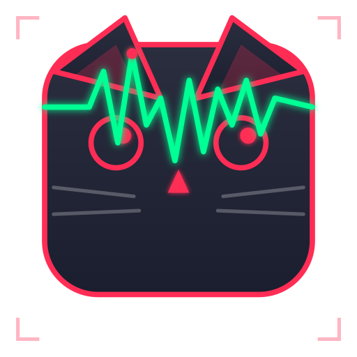

# CritiCat - Система мониторинга критических значений лабораторных исследований

<div align="center">  </div>

## 📋 О проекте

CritiCat - это комплексная система для оперативного мониторинга критических значений лабораторных исследований. Система автоматически отслеживает результаты анализов в ЛИС и мгновенно уведомляет ответственный персонал через Telegram-бота и мобильное приложение с гарантированной доставкой сообщений.

## 🎯 Ключевые возможности

- **Автоматический мониторинг** - система опрашивает базу данных ЛИС и выявляет критические результаты

- **Мгновенные оповещения** - отправка уведомлений через Telegram и собственное мобильное приложение с детальной информацией о критических значениях

- **Двухэтапное подтверждение** - получение подтверждения от ответственного лица через Telegram и через связанное мобильное приложение

- **Полнотекстовый поиск** и аудит всех действий с найденными результатами

- **Отказоустойчивая архитектура** - использование брокера RabbitMQ для гарантированной доставки сообщений и обработки сбоев

## 🏗️ Архитектура

### Компоненты системы

1. **Desktop Module** - извлекает критические результаты из ЛИС и отправляет их в систему
2. **Backend Server** - центральный сервер на FastAPI, управляет очередями и бизнес-логикой
3. **Mobile App** - Flutter-приложение для получения уведомлений и подтверждения результатов
4. **RabbitMQ** - брокер сообщений для надежной асинхронной коммуникации

### Схема очередей RabbitMQ

Система использует 9 очередей и 2 обменника для обеспечения надежной доставки:

| Очередь | Тип | Назначение |
|---------|-----|------------|
| `lab.critical.results` | Quorum | Прием сырых результатов от десктопа |
| `alert.app.queue` | Classic | Рассылка уведомлений в мобильное приложение |
| `pending.confirmation.queue` | Quorum | Хранилище ожидающих подтверждения результатов |
| `user.response.queue` | Classic | Прием ответов от пользователей |
| `rejected.results.queue` | Classic | Буфер для записи отклоненных результатов |
| `desktop.confirmation.queue` | Classic | Подтверждения для десктоп-модуля |
| `retry.delay.queue` | Classic | Задержка перед повторной отправкой |
| `failed.alerts.queue` | Classic | "Мертвые" письма для ручного разбора |

### Как это работает

1. **Входящий поток**:
   - Десктоп отправляет результат в `lab.critical.results`
   - Бекенд сохраняет результат в БД (статус `PENDING`)
   - Бекенд публикует копии в `alert.app.queue` и `pending.confirmation.queue`

2. **Доставка уведомлений**:   
   - Модуль приложения отправляет Push-уведомление
   - **Важно**: ACK отправляется только после реальной отправки уведомления

3. **Обработка сбоев (Retry)**:
   - Если модуль не забрал сообщение за 1 минуту → сообщение попадает в `retry.delay.queue`
   - Через 5 минут → повторная попытка
   - После 3 неудачных попыток → сообщение в `failed.alerts.queue`

4. **Ожидание подтверждения**:
   - Сообщение хранится в `pending.confirmation.queue` до 24 часов (или пока пользователь не ответит)
   - Quorum Queue гарантирует сохранность даже при сбоях RabbitMQ

5. **Ответ пользователя**:
   - Врач нажимает "Подтвердить" в приложении
   - Ответ отправляется в `user.response.queue`
   - Бекенд обрабатывает ответ:
     - **Подтверждено**: удаляет из `pending.confirmation.queue`, отправляет команду десктопу
     - **Отклонено**: удаляет из `pending.confirmation.queue`, сохраняет в `rejected.results.queue`

Проверка состояния системы:

```bash
# Healthcheck
curl http://localhost:26000/health

# Статистика
curl -X GET http://localhost:26000/api/v1/statistics \
  -H "X-API-Key: default-secret-key"

# Все результаты
curl -X GET http://localhost:26000/api/v1/results/all \
  -H "X-API-Key: default-secret-key"
```

### 6. Управление очередями RabbitMQ

```bash
# Просмотр очередей
docker exec criticat-rabbitmq rabbitmqctl list_queues

# Просмотр содержимого очереди
docker exec criticat-rabbitmq rabbitmqctl list_queues name messages_ready

# Очистка очереди
docker exec criticat-rabbitmq rabbitmqctl purge_queue alert.telegram.queue
```

## 🔧 Установка

### Требования
- Docker 20.10+
- Docker Compose 2.0+
- Git
- Flutter 3.0+ (для мобильного приложения)

### Запуск из исходного кода

```bash
# Клонирование репозитория
git clone https://github.com/knyazhninstanislav/criticat.git
cd criticat

# Настройка окружения
cp .env.example .env
nano .env  # Отредактируйте файл с вашими настройками

# Запуск всех сервисов
docker-compose up -d

# Проверка статуса
docker-compose ps

# Просмотр логов
docker-compose logs -f
```

### Переменные окружения (.env)

```env
# API
API_KEY=your_secret_api_key
LOG_LEVEL=INFO

# RabbitMQ
RABBITMQ_USER=admin
RABBITMQ_PASSWORD=secure_password
RABBITMQ_VHOST=/

# Настройки очередей
MESSAGE_TTL=60000      # 1 минута
RETRY_DELAY=300000     # 5 минут
MAX_RETRIES=3          # Максимум попыток
PENDING_TIMEOUT_HOURS=24 # Время ожидания подтверждения
```

## 🏥 Для медицинских работников

### Как получать уведомления:
**Мобильное приложение**:
   - Скачайте и установите приложение
   - Введите настройки сервера
   - Войдите с вашими учетными данными
   - Получавайте Push-уведомления

### Как подтверждать результаты:

В приложении - откройте результат и нажмите кнопку

### Что означают статусы результатов:

- **Ожидает** - результат получен, ожидает вашего подтверждения
- **Отправлено** - уведомление отправлено, ожидается ответ
- **Подтверждено** - вы подтвердили результат
- **Отклонено** - вы отклонили результат (будет сохранено в истории)

## 🛠️ Разработка

### Структура проекта

```
criticat/
├── app/                    # Backend (FastAPI)
│   ├── api.py             # REST API эндпоинты
│   ├── rabbitmq_client.py # Клиент RabbitMQ
│   ├── workers.py         # Фоновые воркеры
├── criticat_mobile/        # Flutter приложение
│   ├── lib/
│   │   ├── models/        # Модели данных
│   │   ├── screens/       # Экраны
│   │   ├── services/      # Сервисы (API, уведомления)
│   │   └── widgets/       # Переиспользуемые виджеты
├── docker-compose.yaml     # Docker Compose конфигурация
└── README.md
```

### Локальная разработка

```bash
# Бекенд
cd criticat
python -m venv venv
source venv/bin/activate  # Windows: venv\Scripts\activate
pip install -r requirements.txt
uvicorn app.main:app --reload

# Мобильное приложение
cd criticat_mobile
flutter pub get
flutter run
```

## 🔒 Безопасность

- Все API запросы требуют API-ключ
- Данные обезличены (хранятся только IDS пациента)
- Логирование всех действий для аудита
- Безопасное хранение токенов в переменных окружения

## 📝 Лицензия

MIT License

## 🤝 Контрибьюция

1. Форкните репозиторий
2. Создайте ветку для фичи (`git checkout -b feature/amazing-feature`)
3. Закоммитьте изменения (`git commit -m 'Add amazing feature'`)
4. Запушьте в ветку (`git push origin feature/amazing-feature`)
5. Откройте Pull Request

---

<p align="center">
  <strong>Сделано с ❤️ для медицинских работников</strong>
</p>

<p align="center"> 
  <a href="https://github.com/knyazhninstanislav/criticat/issues">Сообщить об ошибке</a> •
  <a href="https://github.com/knyazhninstanislav/criticat/discussions">Обсуждения</a>
</p>
