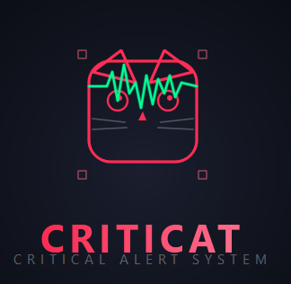

# CritiCat - Система мониторинга критических значений лабораторных исследований



## 📋 О проекте
Criticat - это комплексная система для оперативного мониторинга критических значений лабораторных исследований. Система автоматически отслеживает результаты анализов в ЛИС и мгновенно уведомляет ответственный персонал через Telegram-бота.

## 🎯 Ключевые возможности
- Автоматический мониторинг - система опрашивает базу данных ЛИС и выявляет критические результаты

- Telegram-уведомления - мгновенные оповещения с детальной информацией о критических значениях

- Двухэтапное подтверждение - получение подтверждения от ответственного лица через Telegram

- Интеграция с десктопным приложением - автоматическая передача подтвержденных результатов

- Наличие полнотекстового поиска, аудита всех действий с найденными результатами

### Требования
- Docker 20.10+
- Docker Compose 2.0+
- Git

### Запуск из исходного кода
```bash
git clone https://github.com/knyazhninstanislav/criticat.git
cd criticat 

cp .env.example .env
nano .env  # Отредактируйте файл с вашими настройками

docker-compose up -d
```
<p align="center"> Сделано с ❤️ для медицинских работников </p>
