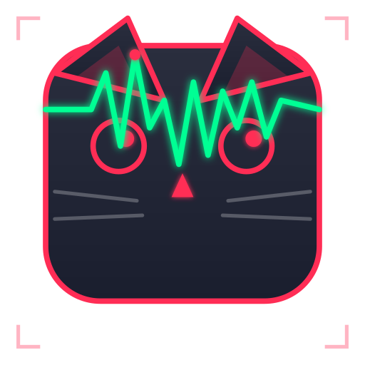

# CritiCat - Система мониторинга критических значений лабораторных исследований

<div align="center">  </div>

## 📋 О проекте

**🩸 CritiCat** - это система оперативного мониторинга критических значений лабораторных исследований. Она автоматически отслеживает новые результаты с приборов или из ЛИС, сравнивает их с настроенными порогами и, если показатель выходит за границы нормы, немедленно уведомляет ответственного врача через мобильное приложение с **гарантированной** доставкой сообщений. 📲

**🚨 Зачем это нужно.** 
Критические значения - это результаты, при которых счёт идёт не на часы, а на минуты: тяжёлая анемия, тромбоцитопения, гиперкалиемия, высокий тропонин. Если такой результат вовремя не попадёт к врачу, последствия могут быть необратимыми. В обычной практике между «анализатор выдал результат» и «врач его увидел» часто проходит слишком много времени - смены, выходные, загруженность, человеческий фактор. CritiCat закрывает этот разрыв: он не ждёт, пока кто-то откроет ЛИС и посмотрит, а сам находит критическое значение и дотягивается до врача там, где он точно увидит - в мобильном приложении. ⏱️ В итоге критические результаты не теряются в потоке рутины, а решения принимаются вовремя. ✅

## 🎯 Ключевые возможности

- **Автоматический мониторинг** - система опрашивает базу данных ЛИС и выявляет критические результаты

- **Мгновенные оповещения** - отправка уведомлений через собственное мобильное приложение с детальной информацией о критических значениях

- **Голосовой обзвон в крайнем случае** - если врач не подтвердил результат через приложение в течение заданного времени, система автоматически звонит в отделение и голосом сообщает о критическом результате

- **Двухэтапное подтверждение** - получение подтверждения от ответственного лица через связанное мобильное приложение

- **Полнотекстовый поиск** и аудит всех действий с найденными результатами

- **Отказоустойчивая архитектура** - использование брокера RabbitMQ для гарантированной доставки сообщений и обработки сбоев

## 🏗️ Архитектура

### Компоненты системы

1. **Desktop Module** - извлекает критические результаты из провайдеров (ЛИС, анализаторы) и отправляет их в систему
2. **Backend Server** - центральный сервер на FastAPI, управляет очередями и бизнес-логикой
3. **Voice Service** - отдельный сервис для голосового обзвона через Twilio, работает изолированно от основного API
4. **Mobile App (в планах)** - Flutter-приложение для получения уведомлений и подтверждения результатов
5. **RabbitMQ** - брокер сообщений для надежной асинхронной коммуникации

### Схема очередей RabbitMQ

Система использует 12 очередей и 2 обменника для обеспечения надежной доставки:

| Очередь | Тип | Назначение |
|---------|-----|------------|
| `lab.critical.results` | Quorum | Прием сырых результатов от десктопа |
| `alert.app.queue` | Classic | Рассылка уведомлений в мобильное приложение |
| `pending.confirmation.queue` | Quorum | Хранилище ожидающих подтверждения результатов |
| `user.response.queue` | Classic | Прием ответов от пользователей |
| `rejected.results.queue` | Classic | Буфер для записи отклоненных результатов |
| `desktop.confirmation.queue` | Classic | Подтверждения для десктоп-модуля |
| `retry.delay.queue` | Classic | Задержка перед повторной отправкой |
| `failed.alerts.queue` | Classic | "Мертвые" письма для ручного разбора |
| `voice.calls.queue` | Quorum | Очередь голосовых звонков для voice-сервиса |
| `voice.escalation.delay` | Classic | Отложенная очередь эскалации (TTL 15 минут) |
| `voice.failed.queue` | Classic | Неудачные звонки для разбора |
| `voice.retry.delay` | Classic | Задержка перед повторным звонком |

### Как это работает

1. **Входящий поток**:
   - Десктоп отправляет результат в `lab.critical.results`
   - Бекенд сохраняет результат в БД (статус `PENDING`)
   - Бекенд публикует копии в `alert.app.queue` и `pending.confirmation.queue`
   - **Бекенд также публикует отложенное сообщение в `voice.escalation.delay`** (TTL 15 минут)

2. **Доставка уведомлений**:   
   - Модуль приложения отправляет Push-уведомление
   - **Важно**: ACK отправляется только после реальной отправки уведомления

3. **Обработка сбоев (Retry)**:
   - Если модуль не забрал сообщение за 1 минуту → сообщение попадает в `retry.delay.queue`
   - Через 5 минут → повторная попытка
   - После 3 неудачных попыток → сообщение в `failed.alerts.queue`

4. **Ожидание подтверждения**:
   - Сообщение хранится в `pending.confirmation.queue` до 24 часов (или пока пользователь не ответит)
   - Quorum Queue гарантирует сохранность даже при сбоях RabbitMQ

5. **Ответ пользователя**:
   - Врач нажимает "Подтвердить" в приложении
   - Ответ отправляется в `user.response.queue`
   - Бекенд обрабатывает ответ:
     - **Подтверждено**: удаляет из `pending.confirmation.queue`, отправляет команду десктопу
     - **Отклонено**: удаляет из `pending.confirmation.queue`, сохраняет в `rejected.results.queue`

6. **Голосовая эскалация (если никто не подтвердил)**:
   - Через 15 минут после создания результата сообщение из `voice.escalation.delay` автоматически попадает в `voice.calls.queue`
   - **Voice Service** забирает сообщение, проверяет:
     - не подтверждён ли уже результат (через свою БД)
     - не попадает ли звонок в тихие часы (по умолчанию 22:00–07:00)
     - есть ли телефон у отделения
   - Если всё ок — звонит через Twilio в отделение и голосом сообщает о критическом результате
   - Если Twilio недоступен или звонок не удался — сообщение уходит в `voice.failed.queue` для ручного разбора

### 📞 Голосовой обзвон: как это работает

Голосовой обзвон — это **крайняя мера**, которая включается только если врач не отреагировал на push-уведомление в мобильном приложении в течение заданного времени (по умолчанию 15 минут). Он не дублирует push, а страхует на случай, когда push не дошёл, врач не увидел или телефон был без звука.

**Логика эскалации:**

```
1. Результат пришёл
       │
       ▼
2. Push в мобильное приложение ──[ 15 минут ]──► подтверждено? ──► YES → конец
       │                                              │
       │                                              NO
       ▼                                              │
3. Голосовой обзвон отделения ◄───────────────────────┘
       │
       ▼
4. Дежурный берёт трубку и слышит:
   "Внимание. В вашем отделении найден критический результат
    лабораторного исследования. Срочно свяжитесь с дежурным врачом."
```

**Ключевые особенности:**

- **Изоляция в отдельный сервис.** Voice Service — отдельный контейнер со своей БД (SQLite), своим RabbitMQ-клиентом и своими настройками. Падение голосового сервиса не влияет на основной API.
- **Свой Twilio-аккаунт.** Все звонки идут через Twilio REST API. Поддерживаются два режима TTS: встроенный `<Say>` (голос Polly.Tatyana) или Yandex SpeechKit для более естественного русского голоса.
- **Тестовый режим.** Переменная `VOICE_TEST_NUMBER` перенаправляет все звонки на указанный номер — удобно для отладки без риска разбудить врачей ночью.
- **Тихие часы.** По умолчанию с 22:00 до 07:00 обзвон не производится (кроме urgent-результатов). Настраивается через `QUIET_HOURS_START` и `QUIET_HOURS_END`.
- **Защита от двойного звонка.** Если по одному и тому же `result_key` уже был звонок за последний час — повторный не производится.
- **Инвалидация отложенных звонков.** Если врач подтвердил результат до истечения TTL — Voice Service проверяет статус через БД и не звонит.
- **Вебхуки Twilio.** Voice Service принимает вебхуки от Twilio о статусе звонка (initiated → ringing → in-progress → completed) и обновляет состояние в своей БД.
- **Fallback на failed-очередь.** Если Twilio вернул ошибку или звонок не удался — сообщение уходит в `voice.failed.queue`, где может быть разобрано вручную.

**Что нужно для работы голосового обзвона:**

- Аккаунт Twilio (trial-аккаунта достаточно для PoC).
- Публичный HTTPS-endpoint для вебхуков Twilio (в проде — nginx/traefik, в деве — ngrok).
- Настроенные телефоны отделений в БД voice-сервиса (таблица `department_phones`).
- Переменные окружения: `TWILIO_ACCOUNT_SID`, `TWILIO_AUTH_TOKEN`, `TWILIO_FROM_NUMBER`, `VOICE_PUBLIC_URL`.

**Ручной тестовый звонок:**

```bash
curl -X POST http://localhost:8081/test/call \
    -H "X-API-Key: your_voice_api_key" \
    -F "phone=+79001234567" \
    -F "phrase_key=critical_department"
```

**Health-check voice-сервиса:**

```bash
curl http://localhost:8081/health
```

Возвращает:

```json
{
  "status": "ok",
  "service": "voice",
  "twilio_configured": true,
  "rabbitmq_connected": true,
  "timestamp": "2026-09-28T12:00:00"
}
```

## 🔧 Установка

### Требования
- Docker 20.10+
- Docker Compose 2.0+
- Git
- Flutter 3.0+ (для мобильного приложения)
- Аккаунт Twilio (для голосового обзвона, опционально)

### Запуск из исходного кода

```bash
# Клонирование репозитория
git clone https://github.com/knyazhninstanislav/criticat.git
cd criticat

# Настройка окружения
cp .env.example .env
nano .env  # Отредактируйте файл с вашими настройками

# Запуск всех сервисов
docker-compose up -d

# Проверка статуса
docker-compose ps

# Просмотр логов
docker-compose logs -f
```

### Переменные окружения (.env)

```env
# API
API_KEY=your_secret_api_key
LOG_LEVEL=INFO

# RabbitMQ
RABBITMQ_USER=admin
RABBITMQ_PASSWORD=secure_password
RABBITMQ_VHOST=/

# Настройки очередей
MESSAGE_TTL=60000      # 1 минута
RETRY_DELAY=300000     # 5 минут
MAX_RETRIES=3          # Максимум попыток
PENDING_TIMEOUT_HOURS=24 # Время ожидания подтверждения

# === Голосовой обзвон (опционально) ===
TWILIO_ACCOUNT_SID=ACxxxxxxxxxxxxxxxxxxxxxxxxxxxxxxxx
TWILIO_AUTH_TOKEN=your_auth_token_here
TWILIO_FROM_NUMBER=+1234567890
VOICE_PUBLIC_URL=https://your-public-url

# TTS: 'twilio' (встроенный <Say>) или 'yandex' (SpeechKit)
TTS_PROVIDER=twilio
YANDEX_TTS_API_KEY=
YANDEX_TTS_FOLDER_ID=

# Через сколько минут запускать обзвон
VOICE_ESCALATION_MINUTES=15
VOICE_ESCALATION_ENABLED=true

# Тихие часы
QUIET_HOURS_START=22
QUIET_HOURS_END=7

# Максимум попыток дозвона
VOICE_MAX_ATTEMPTS=3
VOICE_CALL_TIMEOUT=30

# Тестовый номер (все звонки идут только на него)
VOICE_TEST_NUMBER=+79001234567

# API-ключ для ручного триггера звонка
VOICE_API_KEY=change-me-in-production
```

## 🔒 Безопасность

- Все API запросы требуют API-ключ
- Данные обезличены (хранятся только IDS пациента)
- Логирование всех действий для аудита
- Безопасное хранение токенов в переменных окружения
- **Голосовые фразы не содержат ФИО пациента** — только название отделения и общую формулировку
- **Тихие часы** защищают врачей от ночных звонков
- **Тестовый номер** позволяет отлаживать обзвон без риска

<p align="center">
  <strong>Сделано с ❤️ для медицинских работников</strong>
</p>